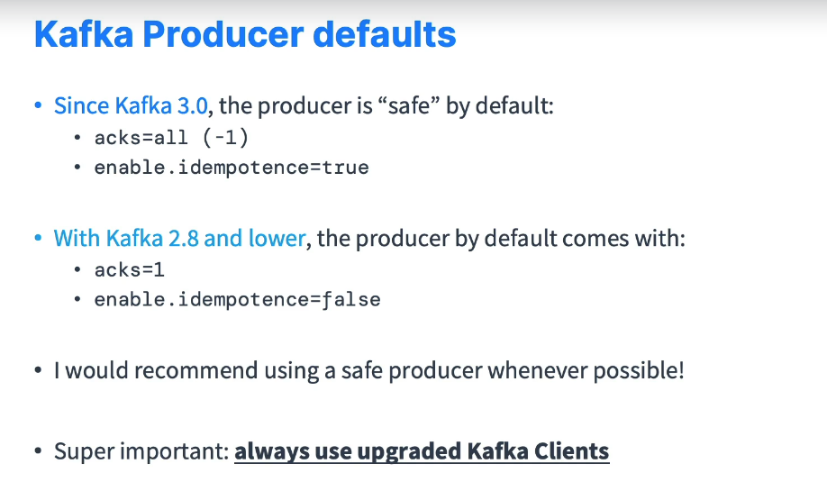
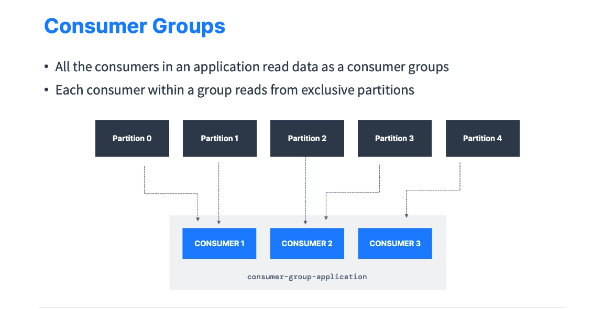
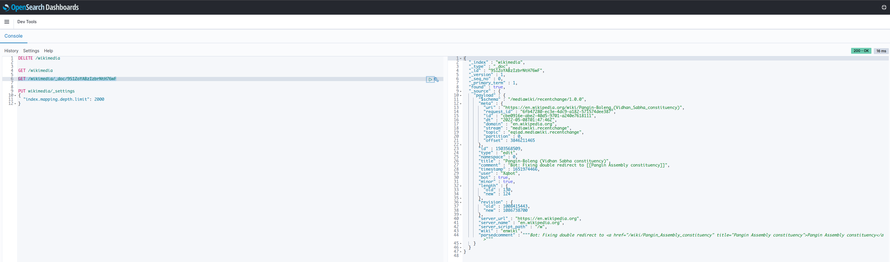
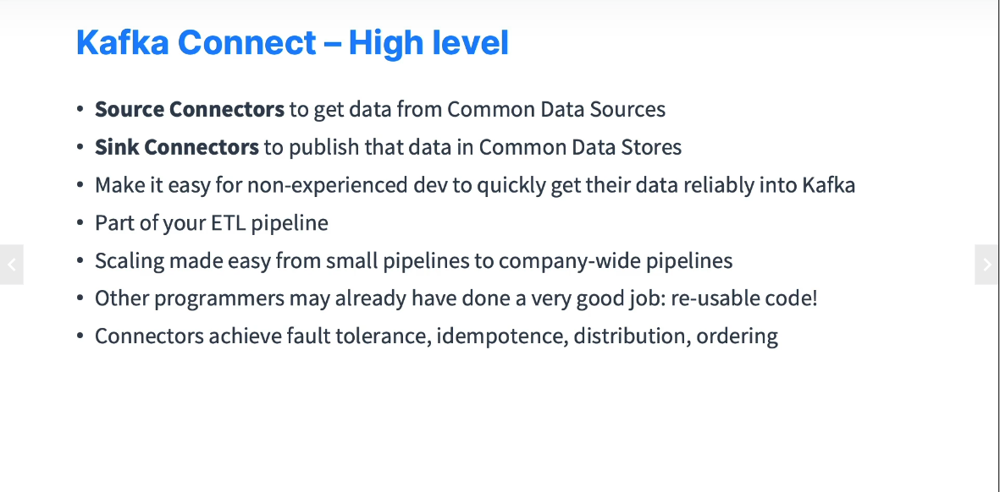
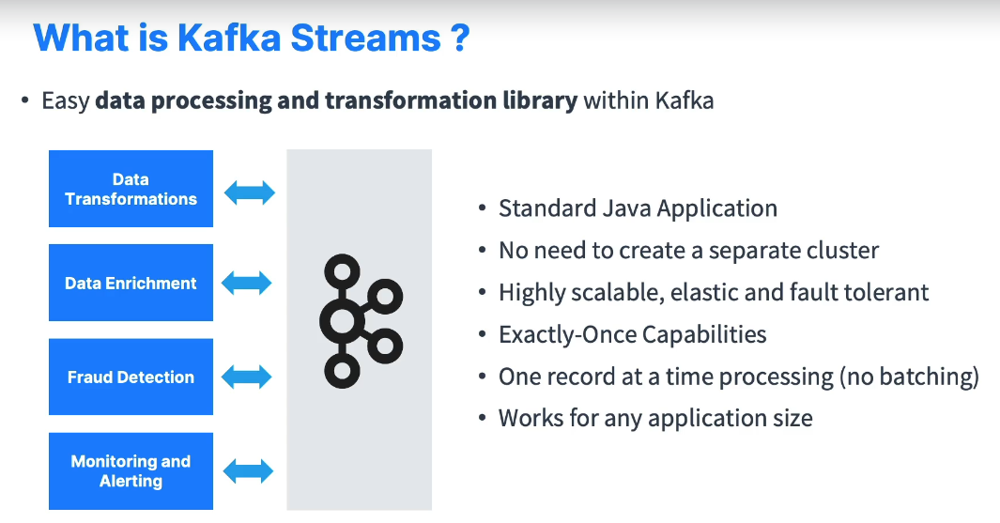
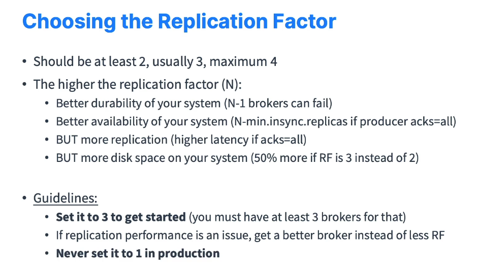
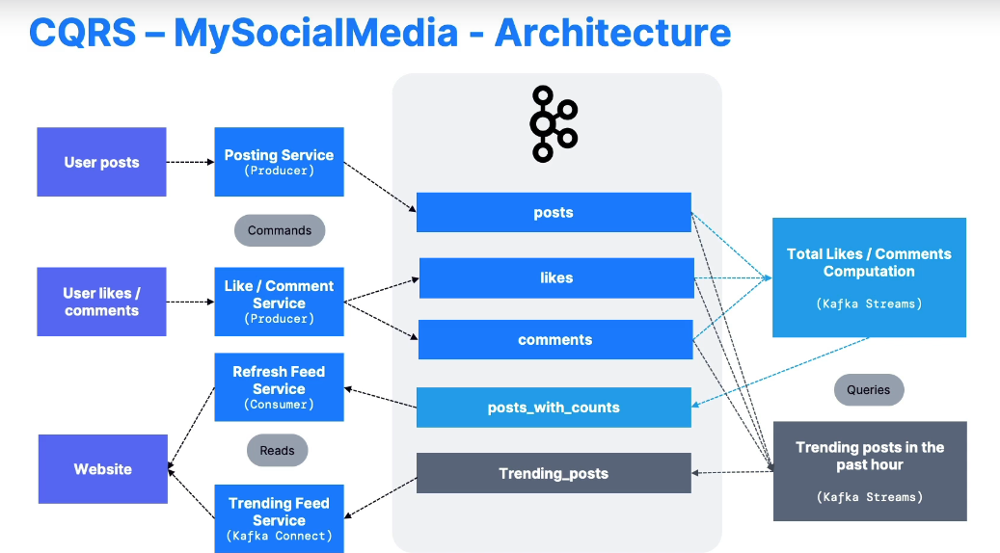

= Kafka Boot Camp

== Links

- https://docs.confluent.io/platform/current/release-notes/index.html[Confluent Platform 7.1.1 Release Notes]
- https://docs.confluent.io/platform/current/quickstart/ce-docker-quickstart.html[Quick Start for Confluent Platform]
- https://camel.apache.org/components/3.15.x/kafka-component.html[Kafka Camel Component]
- https://camel.apache.org/components/3.15.x/twitter-search-component.html[Camel Twitter Search]
- https://camel.apache.org/components/3.16.x/elasticsearch-rest-component.html[Camel ElasticSearch]
- https://sematext.com/blog/logback-tutorial/[Logback Configuration]
- https://developer.twitter.com/[Twitter API Credentials]
- https://www.elastic.co/guide/en/elasticsearch/reference/current/docker.html[Install Elasticsearch with Docker]
- https://hgmauri.medium.com/configurando-o-elasticsearch-e-kibana-no-docker-3f4679eb5feb[Configuration o Elasticsearch e Kibana no Docker]
- https://developer.twitter.com/en[Developer Twitter Account]
- https://twitter.com/logout?redirect_after_logout=[Twitter Developer Login]
- https://stackoverflow.com/questions/59957542/can%C2%B4t-start-elasticsearch-docker-container[ElasticSearch Access Denied Exception]
- https://stream.wikimedia.org/v2/stream/recentchange[Recent Change Streams]
- https://howtodoinjava.com/kafka/spring-boot-jsonserializer-example/[Spring Boot Kafka JsonSerializer Example]
- https://howtodoinjava.com/kafka/spring-boot-jsonserializer-example/[Spring Boot Kafka JsonSerializer Example]
- https://www.elastic.co/guide/en/elasticsearch/reference/current/mapping-settings-limit.html[Mapping limit settings]
- https://cnr.sh/essays/how-paint-bike-shed-kafka-topic-naming-conventions[Kafka Topic Naming Conventions]

== Twitter texts to be approved on prompt

****
I intend to use this Twitter feed to get real data streams into an application that will put data into Kafka, after that this data will end up in a ELK stack at the end and this just a POC purpose, to show how Apache Camel shines over code bloat up until languages such Python.
This is no Commercial app and will result in any besides product deployment Twitter data will not be displayed, and we will only extract tweets on low, very low terms
****

== Acks (Acknowledgement) Modes

. Ack (0) No Response is required, if the broker goes offline or an exception happens, we won't know and will lose data
. Ack (1) Leader response is requested, but replication is not guarantee (happens in background), if an ack is not received, the producer may retry, if the leader goes down/offline and replicas haven't replicated the data yet, we have a data loss
. Ack (all) Leader + Replicas ack requested, this configuration is necessary if lost data is not an option, in this option we need configure #_min.insync.replicas_# to set at the broker or topic level, e.g. #_min.insync.replicas=2_# means that at least 2 brokers that are ISR (including leader) must respond that they have the data
. In camel Acks property can be represented by requestRequired Acks just in Producer mode

== Idempotent Producer

. The producer can introduce duplicated messages in Kafka due to networks failures
. Idempotent producers are great to guarantee a stable and safe pipeline
. They are the #_default since Kafka 3.0, recommended to use them_#
. Since #_Kafka 3.0_#, the producer is "safe" by default

.Kafka Producer defaults

== Message Compression

. Always use message compression in production if high throughput is a mandatory requirement, and test all them to fit the best algorithm compression for that case

. The batch size default is 16384 (16KB)
. Snappy compression type is very helpful if your message are text based, such as log or JSON documents

.Multiple Grouped Consumer in Multiple partitions

== ELK Basic Commands

[source,bash]
----
GET /_cat/indices?v
GET /_cat/nodes?v
GET /_cat/health?v

PUT /twitter

PUT /twitter/tweets/1
{
  "text": "bla"
}

GET /wikimedia/_doc/9S1ZoYABzIzbrNtH76wF
----

.GET /wikimedia/_doc/9S1ZoYABzIzbrNtH76wF

== Configuration Mapping limit setting

[source,bash]
----
PUT wikimedia/_settings
{
  "index.mapping.depth.limit": 2000
}
----

== Wikimedia on Java Implementation

[source,java]
----
@Component
@AllArgsConstructor
public class WikimediaChangesProducer {

  private final ProducerTemplate template;

  final class MyWikimediaChangeHandler implements EventHandler {

    @Override
    public void onOpen() {
      // Not will be implemented
    }

    @Override
    public void onClosed() {
      // Not will be implemented
    }

    @Override
    public void onMessage(String s, MessageEvent messageEvent) {
      //log.info("{}", messageEvent.getData());
      WikimediaChangesProducer.
        this.template.asyncSendBody("seda://wikiMediaProducer", messageEvent.getData());
    }

    @Override
    public void onComment(String s) {
      // Not will be implemented
    }

    @Override
    public void onError(Throwable throwable) {
      // Not will be implemented
    }
  }

  @PostConstruct
  public void setUp() {
    var event = new MyWikimediaChangeHandler();
    var url = "https://stream.wikimedia.org/v2/stream/recentchange";
    var build = new EventSource.Builder(event, URI.create(url));
    var eventSource = build.build();

    eventSource.start();
  }

}
----

* _wikimedia.recentchange_ kafka topic

[source,bash]
----
docker rmi $(docker images --format '{{.Repository}}:{{.Tag}}'|grep 'confluentinc')
----

[source,html]
----
enableIdempotence (producer)

If set to 'true' the producer will ensure that exactly one copy of each message is written in the stream. If 'false', producer retries may write duplicates of the retried message in the stream. If set to true this option will require max.in.flight.requests.per.connection to be set to 1 and retries cannot be zero and additionally acks must be set to 'all'. it is false by default
----

== Kafka Connectors Overview

.Kafka Connectors Overview

== Kafka Stream Quick Intro

. Easy data processing (stats) and transformation lib within kafka, down bellow a quick summary

.Kafka Streams quick Summary

=== Tips Kafka

. The _two most important_ parameter when a topic is configured are (Partitions Count & Replication Factor), because they impact performance and durability of the system overall

.Replication Factor Guidelines

.Social Media Solution using CQRS

